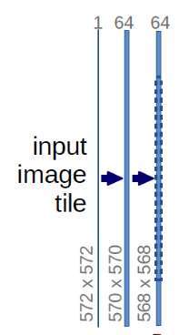

Group: 




```python
class DoubleCov(nn.Module):
    def __init__(self, params):
        super().__init__()
        self.conv = nn.Sequential(
            nn.Conv2d(params.in_channels, params.out_channels),
            nn.BatchNorm2d(params.out_channels),
            nn.ReLU(inplace=True),
            nn.Conv2d(params.out_channels, params.out_channels),
            nn.BatchNorm2d(params.out_channels),
            nn.ReLU(inplace=True)
        )
    
    def forward(self, img):
        return self.conv(img)
```


